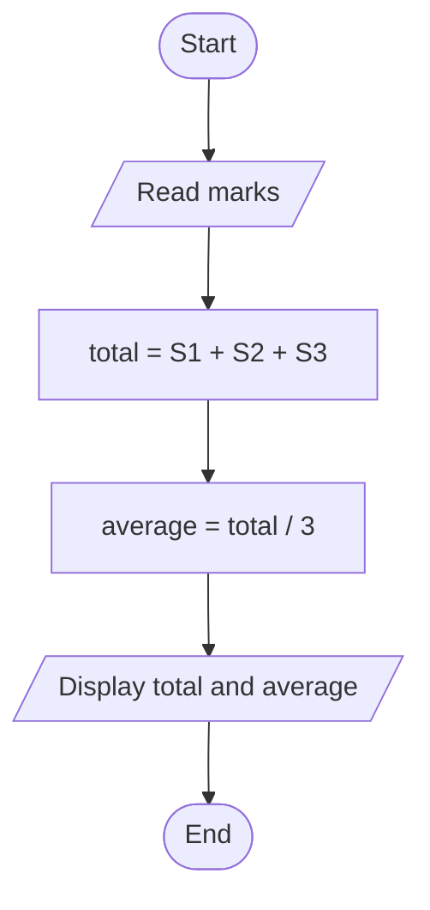

# Flowcharts

2. Calculate Total and Average Marks

```
START
  READ Subject1
  READ Subject2
  READ Subject3
  total = Subject1 + Subject2 + Subject3
  average = total / 3
  PRINT "Total =", total
  PRINT "Average =", average
END
```


