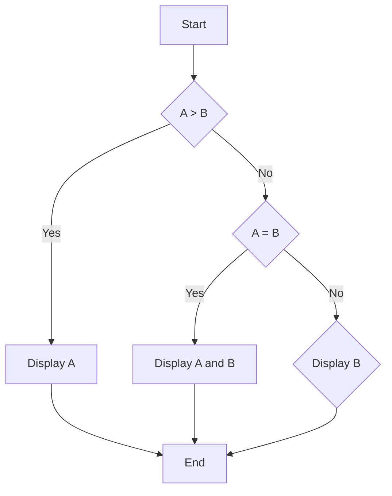

# Flowcharts

```mermaid
flowchart TD
  A[Start] --> B{A > B}
  B -- Yes --> C[Display A]
  C --> Z[End]
  B -- No  --> D{A = B}
  D -- Yes --> E[Display A and B]
  D -- No  --> F{Display B}
  E --> Z
  F --> Z
```
