```mermaid
flowchart TD
  Start([Start]) --> Input[/"Read n (n ≥ 0)"/]
  Input --> Init["fact = 1\ni = 1"]
  Init --> Check{ i <= n ? }
  Check -- Yes --> Multiply["fact = fact * i"]
  Multiply --> Increment["i = i + 1"]
  Increment --> Check
  Check -- No --> Output[/"Display fact"/]
  Output --> End([End])
```

# Flowcharts

2. Calculate Total and Average Marks

```pseudocode
START
  READ A, B , C
  total = A + B + C
  average = total / 3
  PRINT "Total =", total
  PRINT "Average =", average
END
```


---
3. Display Multiplication Table
```pseudocode
START
  READ n
  i = 1
  WHILE i <= 10 DO
    product = n * i
    PRINT n, "x", i, "=", product
    i = i + 1
  END WHILE
END
```

---
4. Positive, Negative, or Zero Check
```pseudocode
START
  READ n
  IF n > 0 THEN
    PRINT "Positive"
  ELSE IF n < 0 THEN
    PRINT "Negative"
  ELSE
    PRINT "Zero"
  END IF
END
```

---
5. Simple Interest Calculator
```pseudocode
START
  READ P
  READ R
  READ T
  SI = (P * R * T) / 100
  PRINT "Simple Interest =", SI
END
```

---
6. Average Temperature Calculation
```pseudocode
START
  total = 0
  i = 1
  WHILE i <= 7 DO
    READ temp
    total = total + temp
    i = i + 1
  END WHILE
  average = total / 7
  PRINT "Average =", average
END
```

---
7. Calculate Area of a Rectangle
```pseudocode
START
  READ L
  READ W
  area = L * W
  PRINT "Area =", area
END
```

---
8. Determine Pass or Fail
```pseudocode
START
  READ avg
  IF avg >= 50 THEN
    PRINT "Pass"
  ELSE
    PRINT "Fail"
  END IF
END
```

---
9. Calculate Factorial of a Number
```pseudocode
START
  READ n
  fact = 1
  i = 1
  WHILE i <= n DO
    fact = fact * i
    i = i + 1
  END WHILE
  PRINT "Factorial =", fact
END
```

---
10. Calculate Discount on Purchase
```pseudocode
START
  READ purchase_amount
  IF purchase_amount > 1000 THEN
    discount = purchase_amount * 0.10
    final_amount = purchase_amount - discount
  ELSE
    discount = 0
    final_amount = purchase_amount
  END IF
  PRINT "Discount =", discount
  PRINT "Final Amount =", final_amount
END
```

